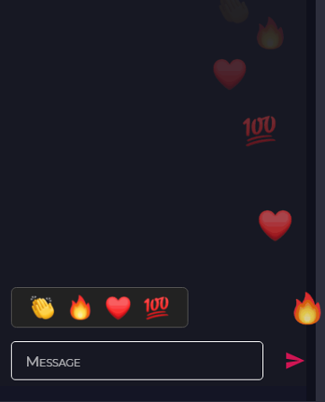
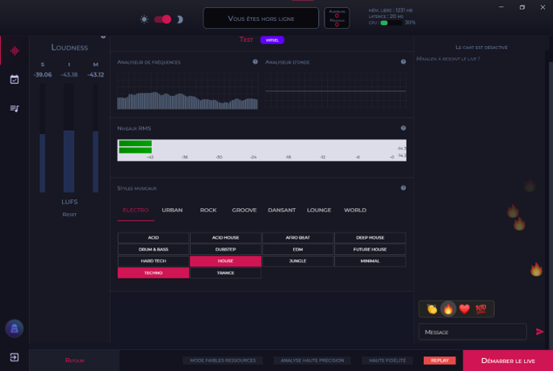

# chat-app (client side)

During my intership in a startup in Montpellier my prime mission was to realize a chat component in React, Typescript and powered by Websockets. Thereafter I had to integrate it in the existing code.  
Below, 1st screenshot is a zoom of the chat, 2nd screenshot is where it fits on the main app.

 

 

 

 

## Available scripts

In the project directory, you can run:

### `npm install`

Installs all the dependencies

### `npm start`

Runs the app in the development mode.\
Open [http://localhost:3000](http://localhost:3000) to view it in the browser.

